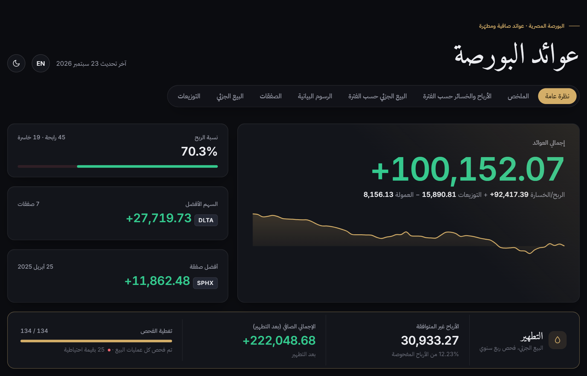
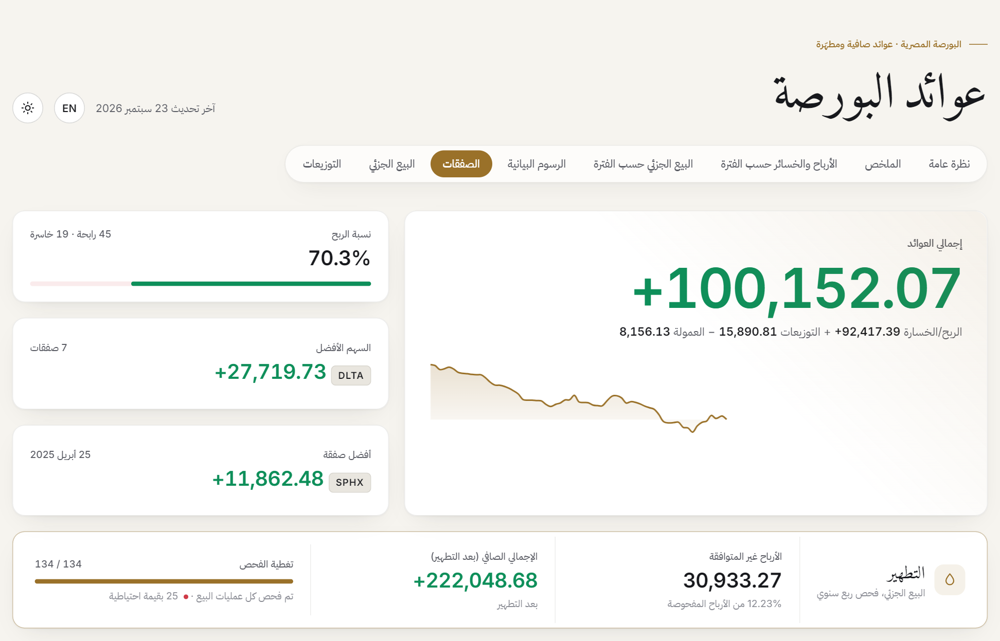
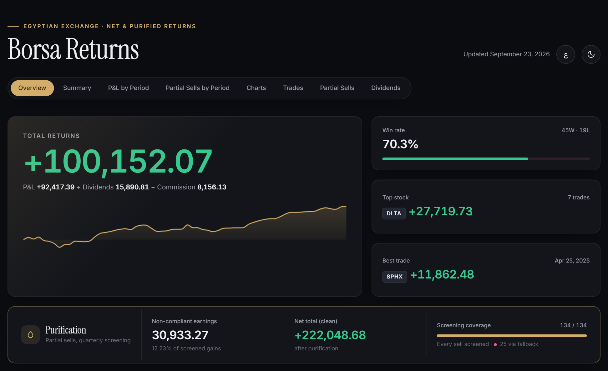
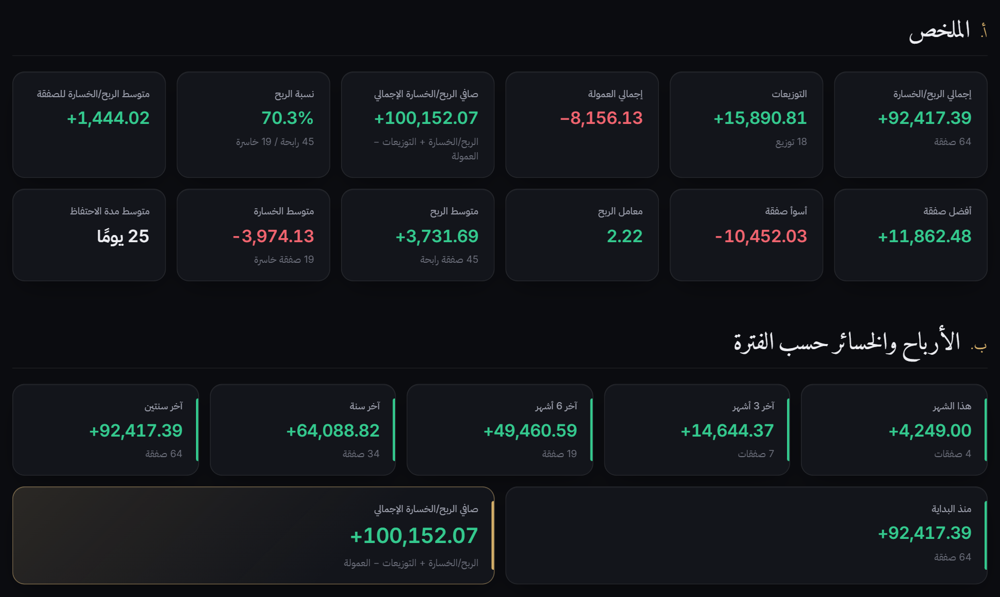
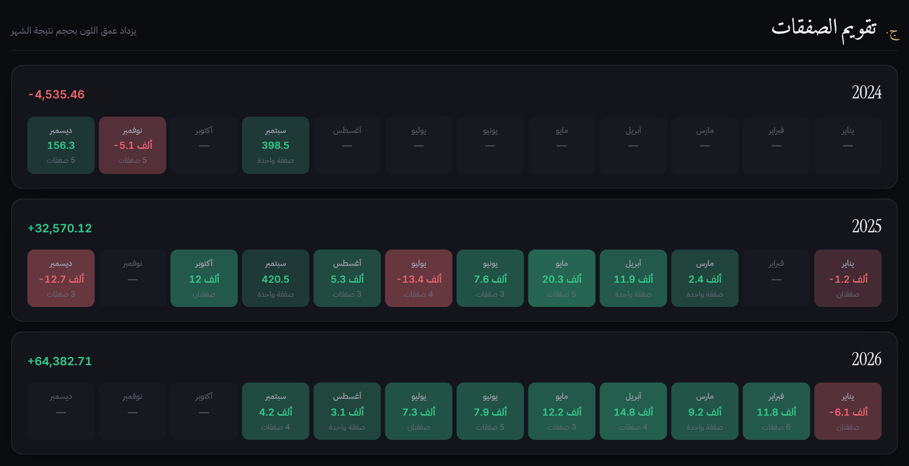
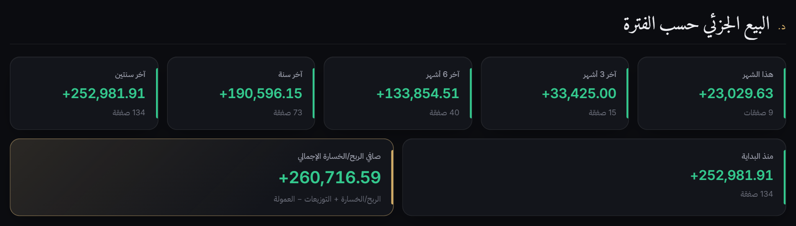
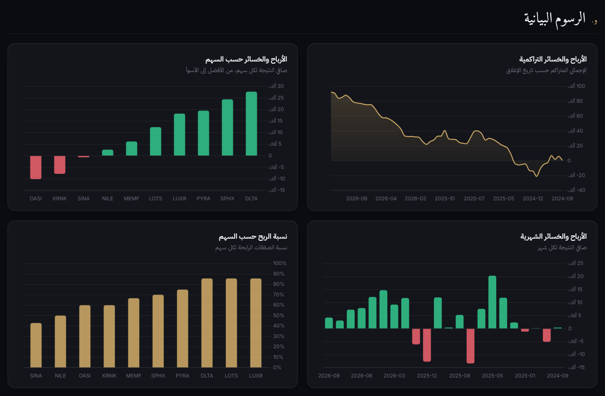
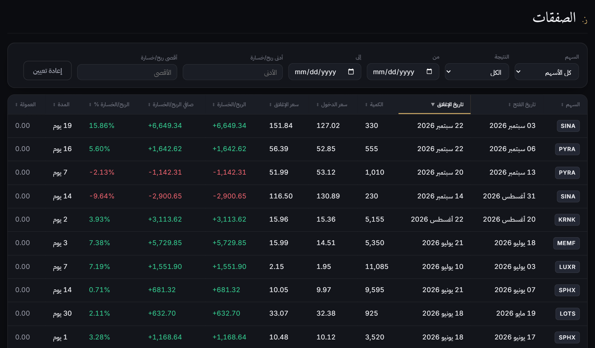
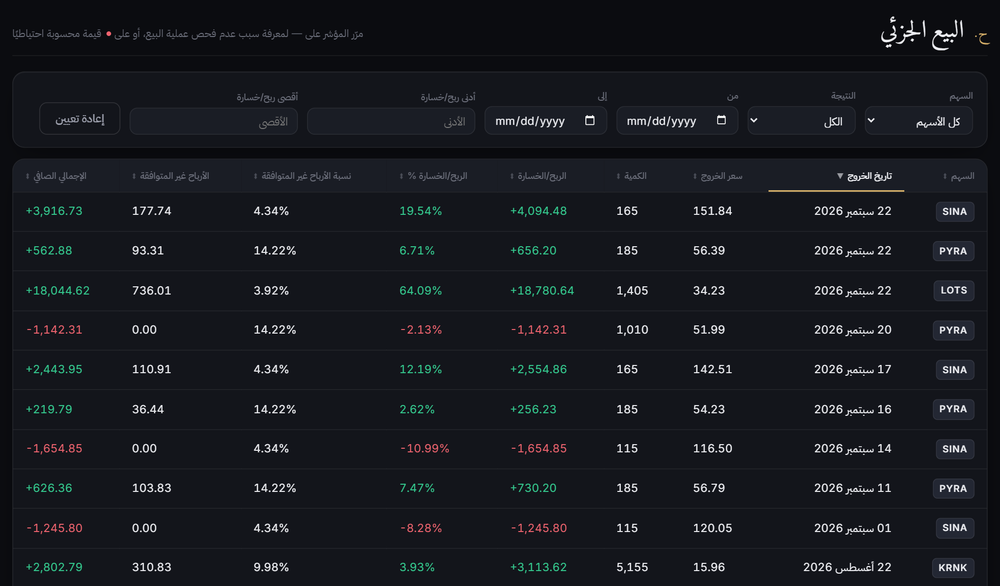
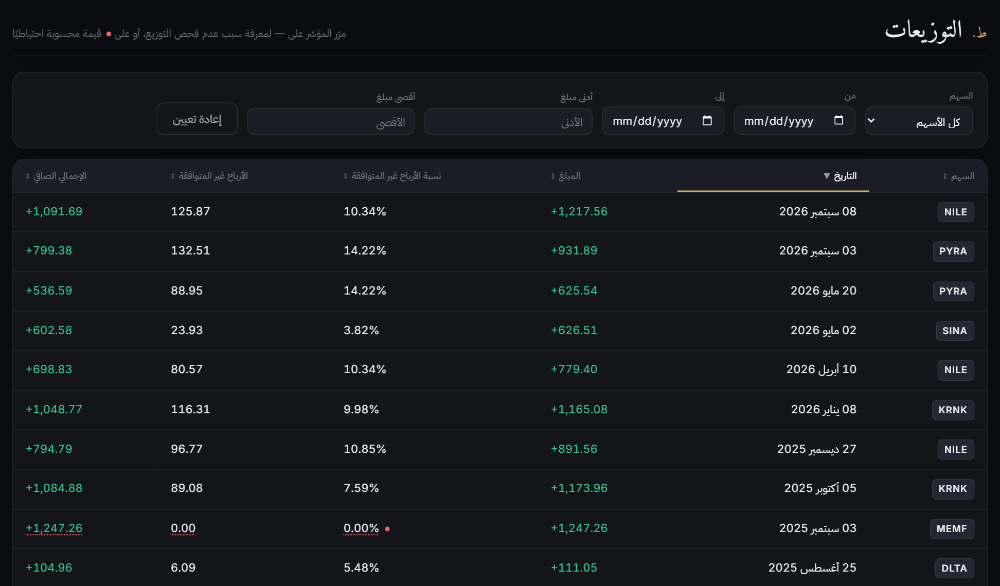

# Borsa Returns · عوائد البورصة

A .NET command-line tool that turns trade exports from [ThndrX](https://thndr.app/) (Thndr's advanced trading platform for the Egyptian Exchange) into a single, self-contained HTML dashboard. The dashboard covers performance KPIs, P&L by period, monthly calendars, charts, filterable trade tables, dividends and Sharia purification (non-compliant earnings).

The output is one static HTML file. It needs no server or database, and you can open it straight from disk.

## Disclaimer

- This is an independent, personal project. It is **not affiliated with, endorsed by or supported by Thndr or Borsa Halal**. Product names are used only to describe compatible data sources.
- The dashboard is a record-keeping and visualization aid. It is **not financial, tax or religious advice**. Check purification amounts against your own trusted Sharia-screening source and scholarly guidance.
- The bundled data is fictional and auto-generated for demonstration only.

> [!IMPORTANT]
> **All data in this repository is fictional.** The files under [`data/`](data/) and the sample dashboard and screenshots under [`docs/`](docs/) were **auto-generated for demonstration only**. The ticker symbols (`NILE`, `PYRA`, `SPHX`, …), prices, trades, dividends and Sharia-screening percentages are made up and do not describe any real company, security or portfolio.



**[View the sample dashboard →](https://htmlpreview.github.io/?https://github.com/atia-ts/borsa-returns/blob/main/docs/sample-dashboard.html)** (generated from the sample data; the source file is [`docs/sample-dashboard.html`](docs/sample-dashboard.html))

---

## Contents

- [Features](#features)
- [Getting started](#getting-started)
- [Input sources (`data/` folder)](#input-sources-data-folder)
- [Full trades vs. partial sells](#full-trades-vs-partial-sells)
- [The commission parameter](#the-commission-parameter)
- [Purification (non-compliant earnings)](#purification-non-compliant-earnings)
- [Output](#output)
- [Screenshots](#screenshots)
- [Project structure](#project-structure)
- [Disclaimer](#disclaimer)

## Features

- **Overview**: total returns with a cumulative P&L sparkline, win rate, top stock, best trade, and a purification summary.
- **Summary KPIs**: total P&L, dividends, commission, net P&L, win rate, average P&L, best and worst trade, profit factor, average profit and loss, and average holding period.
- **P&L by period**: this month, past 3 and 6 months, past 1 and 2 years, and all time. Full trades and partial sells are shown separately.
- **Monthly calendars**: a heatmap of monthly results grouped by year, for both trades and partial sells.
- **Charts**: cumulative P&L, P&L by stock, monthly P&L and win rate by stock (built with [Chart.js](https://www.chartjs.org/)).
- **Interactive tables**: trades, partial sells and dividends, each with its own filters (stock, outcome, date range, amount range) and sortable columns.
- **Purification**: the non-compliant (haram) share of each partial sell and dividend, with configurable fallbacks when screening data is missing.
- **Light and dark themes**: follows the OS setting by default and remembers your choice.
- **Arabic and English**: the dashboard opens in Arabic (right-to-left) and has a toggle for English. Your choice is remembered. Stock symbols always stay in English.

## Getting started

### Prerequisites

- [.NET 10 SDK](https://dotnet.microsoft.com/download)

### Run

From the repository root:

```bash
dotnet run --project src/BorsaReturns
```

With the total commission paid (see [The commission parameter](#the-commission-parameter)):

```bash
dotnet run --project src/BorsaReturns -- 8156.13
```

The tool reads from `data/`, writes to `output/` (both relative to the working directory, so run it from the repository root) and opens the dashboard in your default browser.

Sample console output:

```text
Using trading journal: trading-journal-egypt-0000-sample.csv
Using partial sells: partial-sells-egypt-0000-sample.csv
Using dividends: dividends-0000-sample.csv
Loaded 64 trades
Loaded 134 partial sells
Loaded 18 dividends totalling 15,890.81
Loaded stocks info for 9 symbols
Purification fallback quarter: 2026-Q1
Purification fallback percentage: 10%
Dividend purification fallback percentage: 0%
Non-compliant earnings: 134 computed, 0 blocked, 25 via fallback — haram 30,933.27, clean 222,048.68
Non-compliant dividends: 18 computed, 0 blocked, 3 via fallback — haram 1,097.62, clean 14,793.19
Dashboard written to: .../output/trades_journal_dashboard.html
```

## Input sources (`data/` folder)

All inputs live in the `data/` folder. At least one of the trading journal or the partial sells file must be present. The other inputs are optional, and the dashboard hides the sections that have no data.

| Input                          | File name pattern             | Source                                                                  | Required                          |
| ------------------------------ | ----------------------------- | ----------------------------------------------------------------------- | --------------------------------- |
| Trading journal (full trades)  | `trading-journal-egypt-*.csv` | ThndrX export                                                           | One of these two                  |
| Partial sells (sell history)   | `partial-sells-egypt-*.csv`   | ThndrX export                                                           | One of these two                  |
| Dividends                      | `dividends*.csv`              | Maintained by you                                                       | Optional                          |
| Stocks info (Sharia screening) | `stocks-info.json`            | Maintained by you, e.g. from [Borsa Halal](https://www.borsahalal.com/) | Optional; needed for purification |

When several files match a pattern, the tool uses the **latest one by file name** (sorted descending). ThndrX exports carry a timestamp in their name (for example `trading-journal-egypt-2026-09-20_17-59-01.csv`), so the newest export wins. The bundled samples are named `*-0000-sample.csv`, which sorts before any real export: once you add your own files, they take precedence over the samples.

### Exporting from ThndrX

[ThndrX](https://thndr.app/) is Thndr's advanced web trading platform. It is available at [x.thndr.app](https://x.thndr.app) with a Thndr Trader subscription (see [How to access ThndrX](https://support.thndr.app/en/articles/801822-how-to-access-thndrx)). The **Trading Journal** on the ThndrX home page can be downloaded as CSV using the download control in each section ([ThndrX Home Page: Account and Performance tabs](https://support.thndr.app/en/articles/842772-thndrx-home-page-account-and-performance-tabs)):

- **Full Trades** → save as `trading-journal-egypt-<timestamp>.csv`
- **Sell History** → save as `partial-sells-egypt-<timestamp>.csv`

Drop both files into `data/` unchanged. The tool reads the ThndrX column layout directly.

### Trading journal CSV

Fully closed positions, one row per round trip.

| Column          | Type    | Notes                    |
| --------------- | ------- | ------------------------ |
| Symbol          | string  | Stock ticker             |
| Entry Date      | string  | `dd/MM/yyyy`             |
| Entry Price     | decimal | Average entry price      |
| Exit Date       | string  | `dd/MM/yyyy`             |
| Exit Price      | decimal |                          |
| Volume          | integer |                          |
| P/L             | decimal | EGP                      |
| P/L %           | decimal | Trailing `%` is stripped |
| Duration (Days) | integer | Holding period           |

### Partial sells CSV

Every sell transaction, whether partial or full.

| Column     | Type    | Notes                    |
| ---------- | ------- | ------------------------ |
| Symbol     | string  | Stock ticker             |
| Exit date  | string  | `dd/MM/yyyy`             |
| Exit Price | decimal |                          |
| Volume     | integer |                          |
| P/L        | decimal | EGP                      |
| P/L %      | decimal | Trailing `%` is stripped |

### Dividends CSV

ThndrX does not export this file. Maintain it yourself from your cash dividend receipts.

```csv
symbol,date,amount
NILE,2026-04-10,779.40
PYRA,2026-05-20,625.54
```

| Column | Type    | Notes                              |
| ------ | ------- | ---------------------------------- |
| symbol | string  | Stock ticker                       |
| date   | string  | `yyyy-MM-dd`, the entitlement date |
| amount | decimal | Payout in EGP                      |

### Stocks info JSON (`stocks-info.json`)

This file holds the Sharia screening data points per stock. The key one is the quarterly **non-compliant (haram) earnings percentage** used for purification. [Borsa Halal](https://www.borsahalal.com/) can be used as the source for the Sharia compliance and purification data points.

```json
[
  {
    "symbol": "NILE",
    "metricType": "haram_earnings_percentage",
    "earnings": [
      { "year": 2025, "quarter": 4, "value": 10.34 },
      { "year": 2026, "quarter": 1, "value": 9.87 }
    ],
    "coreActivityCompliance": "Compliant",
    "interestBearingLoans": [{ "year": 2026, "quarter": 1, "value": 12.5 }]
  }
]
```

| Field                    | Notes                                                                           |
| ------------------------ | ------------------------------------------------------------------------------- |
| `symbol`                 | Stock ticker, matched case-insensitively against the CSVs                       |
| `earnings[]`             | Non-compliant earnings percentage per `year` / `quarter`, used for purification |
| `coreActivityCompliance` | Informational (`Compliant` / `NotCompliant`)                                    |
| `interestBearingLoans[]` | Informational: interest-bearing loans ratio per quarter                         |

### About the bundled sample data

The sample inputs were auto-generated with a fixed random seed to exercise every part of the dashboard:

- **10 fictional stocks**, with 64 full trades, 134 sells and 18 dividend payouts spread from September 2024 to September 2026.
- **Screening percentages** for earnings and interest-bearing loans are random values between 0% and 20%.
- **Fallback scenarios are covered on purpose.** `MEMF` has no entry in `stocks-info.json`. `KRNK`, `LUXR` and `OASI` each have missing quarters. Together they trigger the configured fallback quarter, the fallback percentage and the dividend fallback.

### Using your own data

1. Delete the `*-0000-sample.csv` files (optional, since your exports take precedence anyway).
2. Add your ThndrX exports, and optionally a `dividends*.csv`.
3. Replace `data/stocks-info.json` with your own screening data.

Everything else in `data/` and `output/` is git-ignored. `data/stocks-info.json` is tracked because it holds sample data, so to keep your own version out of commits, run:

```bash
git update-index --skip-worktree data/stocks-info.json
```

## Full trades vs. partial sells

ThndrX reports returns in two ways, and the dashboard keeps them apart for the same reason ([source](https://support.thndr.app/en/articles/842772-thndrx-home-page-account-and-performance-tabs)):

|                    | Full trades (Trading Journal)                                                                        | Partial sells (Sell History)                                         |
| ------------------ | ---------------------------------------------------------------------------------------------------- | -------------------------------------------------------------------- |
| What's included    | **Fully closed positions only**, with entry and exit                                                 | **Every sell transaction**, partial or full                          |
| ThndrX equivalent  | Performance Summary / Stocks Performance; Performance tab _Total Returns_                            | PNL Calendar                                                         |
| When a row appears | Only after the position is completely liquidated. A partial sell alone does not create a full trade. | On every sell                                                        |
| Dashboard sections | Overview hero, Summary KPIs, P&L by Period, Trades Calendar, Charts, Trades table                    | Partial Sells by Period, Partial Sells Calendar, Partial Sells table |

Because of this, the two totals usually differ. Trimming a long-term holding shows up in the partial sells P&L but not in the full trades P&L until the whole position is closed. In the sample data, full trades total **+92,417** while partial sells total **+252,982**. Most of the gap comes from trims of positions that are still open.

**Purification is computed on _partial sells_, because every realized sale counts, whether or not the position is fully closed.**

## The commission parameter

```bash
dotnet run --project src/BorsaReturns -- <totalCommission>
```

|          |                                                                                     |
| -------- | ----------------------------------------------------------------------------------- |
| Position | First (and only) command-line argument                                              |
| Meaning  | **Total** commission and fees paid, in EGP, over the period covered by your exports |
| Format   | Invariant culture number, with `.` as the decimal separator (for example `8156.13`) |
| Default  | `0` when omitted                                                                    |

The ThndrX CSV exports don't include commissions, so you provide the total yourself (for example from your account statements). It is subtracted once at portfolio level:

```text
Total Net P&L = Total P&L (full trades) + Dividends − Commission
```

It appears in the _Total Commission_ and _Total Net P&L_ KPI cards, the overview hero and the P&L by Period summary. The sample dashboard was generated with `8156.13`, which is about 0.1% of the sample turnover.

## Purification (non-compliant earnings)

For each partial sell and each dividend, the tool computes:

```text
Haram       = Earning × Non-compliant % / 100
Clean Total = Earning − Haram
```

Losses have nothing to purify. The percentage is chosen as follows:

|                        | Partial sells                                                                                                    | Dividends                                  |
| ---------------------- | ---------------------------------------------------------------------------------------------------------------- | ------------------------------------------ |
| Quarter used           | The **higher** of the previous quarter and Q4 of the previous year, relative to the sell date. A tie goes to Q4. | Q4 of the year before the entitlement date |
| If data is missing     | 1. The configured fallback quarter<br>2. Otherwise, the fallback percentage                                      | The dividend fallback percentage           |
| If no fallback applies | Blocked: shown as `—` with the reason as a tooltip                                                               | Blocked                                    |

Fallbacks are configured in [`src/BorsaReturns/appsettings.json`](src/BorsaReturns/appsettings.json):

```json
{
  "Purification": {
    "FallbackYear": "2026",
    "FallbackQuarter": "1",
    "FallbackPercentage": 10,
    "DividendFallbackPercentage": 0
  }
}
```

| Setting                            | Effect                                                                                                        |
| ---------------------------------- | ------------------------------------------------------------------------------------------------------------- |
| `FallbackYear` / `FallbackQuarter` | Quarter to use for sells when a candidate quarter is missing (both must be set)                               |
| `FallbackPercentage`               | Percentage for sells when no quarter applies or the stock is unknown. Leave empty to keep such sells blocked. |
| `DividendFallbackPercentage`       | Percentage for dividends when the prior-year Q4 or the stock is missing. Leave empty to keep them blocked.    |

In the tables, values computed from a fallback are marked with a dot and a dotted underline, and the tooltip explains which fallback was used.

## Output

Everything is written to `output/`:

| File                            | Contents                                                                                                           |
| ------------------------------- | ------------------------------------------------------------------------------------------------------------------ |
| `trades_journal_dashboard.html` | The self-contained dashboard, with the data embedded as JSON and inline CSS and JS. Chart.js is loaded from a CDN. |
| `non_compliant_earnings.json`   | Purification report for partial sells: totals plus per-sell items                                                  |
| `non_compliant_dividends.json`  | Purification report for dividends                                                                                  |

To serve the dashboard over HTTP instead of opening the file, use any static server, for example `npx serve output`.

## Screenshots

All screenshots show the fictional sample data (run with a commission of `8156.13`). The dashboard opens in Arabic, so most of them show the Arabic, right-to-left layout. The English overview shows what the language toggle switches to.

|                                                                                                         |                                                                                                              |
| ------------------------------------------------------------------------------------------------------- | ------------------------------------------------------------------------------------------------------------ |
| **Overview (Arabic, dark)**<br>           | **Overview (Arabic, light)**<br>        |
| **Overview (English, dark)**<br>      | **Summary KPIs and P&L by period**<br> |
| **Trades calendar**<br>                         | **Partial sells by period**<br>      |
| **Charts**<br>                                                    | **Trades table**<br>                                       |
| **Partial sells with purification**<br> | **Dividends with purification**<br>                  |

## Project structure

```text
├── data/                        # Inputs (sample files are tracked; everything else is git-ignored)
├── docs/
│   ├── sample-dashboard.html    # Dashboard generated from the sample data
│   └── screenshots/
├── output/                      # Generated dashboard and reports (git-ignored)
└── src/BorsaReturns/
    ├── Program.cs               # CLI entry point and orchestration
    ├── appsettings.json         # Purification fallback settings
    └── Features/
        ├── Dashboard/           # HTML template (C# raw string literal)
        ├── Dividends/           # Dividend model and CSV reader
        ├── Metrics/             # KPIs, periods, charts, calendar
        ├── Persistance/         # Input discovery and output writing
        ├── Purification/        # Non-compliant earnings calculation
        └── Trades/              # Trade model and CSV readers
```

Data flow: **discover inputs → parse CSV/JSON → calculate metrics → calculate purification → render HTML → write output**. See [AGENTS.md](AGENTS.md) for a detailed architecture walkthrough.
